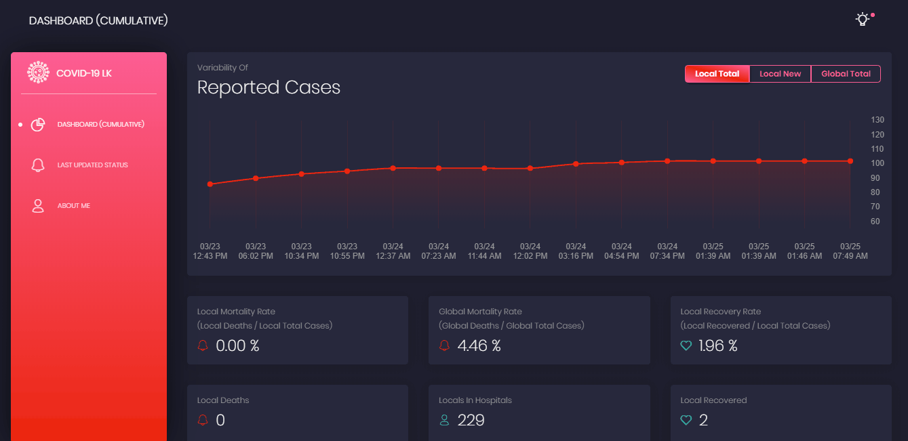

# COVID-19 Dashboard for Sri Lanka
### Visit [covid19lk.herokuapp.com](https://covid19lk.herokuapp.com/) for demo, which provides the current real time situation of the COVID-19 patients reported in Sri Lanka.
##### Visit [nishanc/covid19-api-lk](https://github.com/nishanc/covid19-api-lk) for the API

 

 

API Documentation of Health Promotion Bureau of Sri Lanka can be found [here](https://hpb.health.gov.lk/en/api-documentation).

This project was generated with [Angular CLI](https://github.com/angular/angular-cli) version 9.0.5.

## Development server

Run `ng serve` for a dev server. Navigate to `http://localhost:4200/`. The app will automatically reload if you change any of the source files.

## Code scaffolding

Run `ng generate component component-name` to generate a new component. You can also use `ng generate directive|pipe|service|class|guard|interface|enum|module`.

## Build

Run `ng build` to build the project. The build artifacts will be stored in the `dist/` directory. Use the `--prod` flag for a production build.

## Licensing

- Copyright 2019 [Creative Tim](https://www.creative-tim.com?ref=bda-readme)
- Adapted by [Nishan Chathuranga](https://github.com/nishanc)
- Licensed under [MIT](https://github.com/creativetimofficial/black-dashboard-angular/blob/master/LICENSE.md)